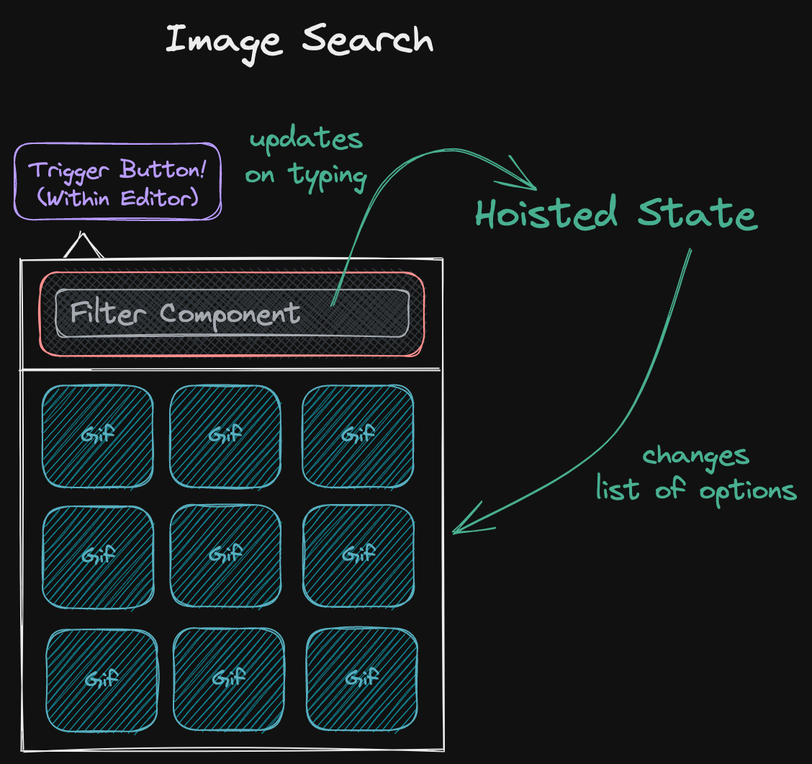

# "Native" Gif Search

## Problem Summary

The current [dropdown menu component](https://github.com/essential-randomness/bobaboard-ui/blob/master/src/common/DropdownListMenu.tsx) (whose current behavior [can be seen here](https://bobaboard-ui.netlify.app/?path=/story/dropdown-preview--multiple-dropdowns)) only allows the display of "text + (optional) icon" options. In order to use it for GIF search (and, in the future, emoji/sticker selection), we need to expand it to include the ability to select between images.

## Current Props and Display

```typescript
interface DropdownProps {
  // The trigger button.
  children: React.ReactElement;
  // Am extra component to optionally display above the set of options.
  header?: React.ReactElement;
  // An array of options to display the dropdown. If no option is present,
  // the trigger button is displayed as it is.
  options?: ({
    name: string;
    icon?: IconDefinition | string;
    color?: string;
  } & (
    | // Click action OR...
    { link: LinkWithAction }
    // ...the recursive set of options for the next page.
    | { options: DropdownProps["options"] }
  ))[];
  /* irrelevant stuff */
}
```

### Desktop View


### Mobile View


## Final Result

### Mockup



### Considerations

- **Q: Can the same "selection page" be comprised of both images and textual options?**
  - No.
- **Q: Can an image selection page be displayed AFTER a textual options page?**
  - Yes, and we can use the same `DropdownContent.previousOption` prop we already have coded to allow returning to the previous page.
- **Q: Can "image selection" have multiple pages?**
  - Technically yes, but I would skip it for now.
- **Q: Which "codebase" should be in charge of making requests to the gifs endpoint?**
  - This has historically been part of the editor itself. It will likely need to change, and I'll
    spend more brainpower on how once we're closer to tying everything up together. **The initial component should not be tied to any particular image provider.** Ideally we could reuse it for Tenor, Giphy or even our own internal search.
- **Q: Do we want it to be simply image selection or also allow selecting videos (bc of the gif size vs mp4 size issue)?**
  - I guess we'll have to support passing videos for gifs, but I'd look at what react-tenor does.
- **Q: What are the accessibility considerations for something like this?**
  - What happens if people pause automatic gif playing? Should they still be playing in the
    selector?
    - IMO, yes.
  - Dropdown should have correct tab order (double-check) but is missing ARIA states. We can fix
    this if we want, but at least adding image selection doesn't make accessibility worse.
  - TBD.

## What We Have

- An example of a dropdown with filterable options in [BoardSelector](https://github.com/essential-randomness/bobaboard-ui/blob/master/src/tags/BoardSelector.tsx).
- A gif search component ([Tenor Keyboard](https://github.com/essential-randomness/boba-editor/blob/master/src/TenorKeyboard.js) in the editor codebase) made by shamefully hacking [React Tenor](https://github.com/CultureHQ/react-tenor) to suit our needs.

## Roadmap

1. Change [DropdownListMenu](https://github.com/essential-randomness/bobaboard-ui/blob/master/src/common/DropdownListMenu.tsx) to allow a series of images as a potential option.
2. Create an `ImageSearch` component that wraps a DropdownList + a filter, and potentially allows choosing between a changing list of suggestions (like in react-tenor).
3. Decide the data flow from user input to the display of the correct list of images for GIF search.
4. Implement the right calls to the Tenor API.
5. Change [Editor](https://github.com/essential-randomness/boba-editor/blob/9d5a60c3c4aea14e7d1b84ec6e3391a3dda2e4c2/src/Editor.tsx) to call to an external component for GIF search.
   - [Example branch](https://github.com/essential-randomness/boba-editor/tree/context-render) of how this could be done by using context.

## Proposed Prop Changes

### Current

```typescript
interface DropdownProps {
  // The trigger button.
  children: React.ReactElement;
  // Am extra component to optionally display above the set of options.
  header?: React.ReactElement;
  // An array of options to display the dropdown. If no option is present,
  // the trigger button is displayed as it is.
  options?: ({
    name: string;
    icon?: IconDefinition | string;
    color?: string;
  } & (
    | // Click action OR...
    { link: LinkWithAction }
    // ...the recursive set of options for the next page.
    | { options: DropdownProps["options"] }
  ))[];
  /* irrelevant stuff */
}
```

### New

#### Text Option Types

```typescript
interface TextOptionWithLink {
    name: string;
    icon?: IconDefinition | string;
    color?: string;
    link: LinkWithAction;
};

interface TextOptionWithNesting {
    name: string;
    icon?: IconDefinition | string;
    color?: string;
    options: DropdownProps["options"]
}

interface TextOption = TextOptionWithLink | TextOptionWithNesting;
```

#### Image Option Type

```typescript
interface ImageOption {
  // If we support video, we likely need to add another option here.
  image: string;
  // For accessibility reasons?
  name?: string;
  // This could just be "onClick" if we don't support "open in a new page".
  link: LinkWithAction;
  // Note: images don't support nesting.
}
```

#### Final Dropdown Type

```typescript
interface DropdownProps {
  /* All the same*/

  // Note: array of images OR array of texts, not mixing them together in the same list.
  // Other note: having a ImageOption[][] would easily enable multiple pages of images,
  // but this doesn't help us for GIF search cause we don't want to fetch all the pages
  // at the same time, so we'd still have to figure out how to do it only on request.
  options?: ImageOption[] | TextOption[];

  /* irrelevant stuff */
}
```

#### Component Code

I think the easiest way of doing this would be to have two separate `DropdownContent` implementations, one for `TextOption[]` and one for `ImageOption[]`. `DropdownContent` can then be a mostly-empty wrapper that just delegates to `DropdownImageContent` or `DropdownTextContent` according to the type of the options array. This means `DropdownMenu`'s code won't have to change.

I think it might make sense to also move the Dropdown code to its own folder and split components in their own files.
