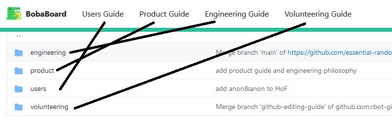

The guide you're currently reading is called
[BobaDocs](https://github.com/essential-randomness/bobadocs). It's built using
[Docusaurus](https://docusaurus.io/).

This page is a brief overview of how Docusaurs' filesystem works, and how that
maps to this documentation. More detailed information can be found in
[Docusaurus' own documentation](https://docusaurus.io/docs/).

## Docusaurus Folder Structure

Docusaurus separates site content into four folders:

- `blog`: containing blogposts (this is unused by BobaDocs at this time)
- `docs`: containing the pages on the site
- `src`: containing information on how to build the site, including styling
- `static`: containing static site data, such as images

## BobaDocs Folder Structure

All the documentation pages in BobaDocs are stored in the `docs` folder as `.md`
files. In `docs`, there are four folders, each of which correspond to one of the
guides on BobaDocs as shown below:



Each of these guides has a different purpose:

- **User Guide**/`users`: Describes how people on the site interact with the
  site in their day-to-day.
- **Project Guide**/`project`: Provides a broad overview of BobaBoard's current
  setup/goals/etc. "What are the features that lead to what the users see, and
  how do they generally work?"
- **Development Guide**/`development`: Provides a more granular overview of
  BobaBoard's current setup/goals/etc. "How is the code set up and what does it
  say, leading to the features described in the Project Guide?"
- **Volunteer Guide**/`volunteer`: Exactly what it sounds like! Includes
  information relevant to all volunteers (ie policies and such) along with how
  to do non-tech volunteer work.

Opening any one of these folders will net you the files and folders that are in
the guide. As an example, here's the Development Guide's files:


Docusaurus uses the structure within each guide's folder to generate the
sidebars for that guide. Each markdown file is a page, and they can be collected
into groups in the sidebar by putting them all in a folder together.

Also of note: the URL of each page comes directly from this folder structure,
with the URL following the pattern:

```
https://bobadocs.netlify.app/[PATH TO FILE]
```

If you replace \[PATH TO FILE] with the filepath in the repo, you get the URL
for that file. The only difference is that the URL doesn't include the file
extension `.md`. For example, the URL of this page, which has the filepath
`/docs/development/docusaurus.md` is:

```
https://bobadocs.netlify.app/docs/development/docusaurus
```
