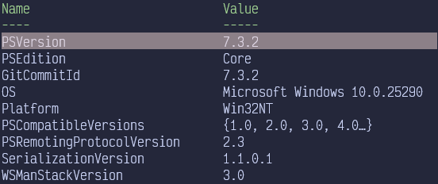
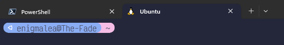

import { Icon } from "@astrojs/starlight/components";
import { Aside } from "@astrojs/starlight/components";

<Aside type="caution">

The following instructions are for Windows users only. If you use Linux or Mac
and have already completed the steps in
[Setup Your Development Environment](/docs/development/start-developing/setting-up-dev-env),
you can skip forward to the next section.

</Aside>

## Guide Introduction

This guide is designed to gather the best resources on setting up WSL to make it
as painless as possible, including explicit instructions for what to install and
where to install it. If you've never used WSL and don't have a current Linux
distro set-up we recommend you follow the guide in order.

In some places we have chosen to link to other installation guides which provide
additional information or context or to ensure you have the most up-to-date
installs. Linking to an external guide is not an indication of complexity! We've
included an estimated reading/working time (not including download and install
times) to give you an idea of how long each external source is; reading/working
estimates appear as [<Icon name="seti:clock" class="inline-icon" /> time].

If you currently have WSL feel free to skip around as needed. We recommend
running WSL2 with an Ubuntu distro. You can upgrade to WSL2 by following the
[instructions here](https://learn.microsoft.com/en-us/windows/wsl/install#upgrade-version-from-wsl-1-to-wsl-2).
[<Icon name="seti:clock" class="inline-icon" /> 1 min] If you're using another
Linux distro you can add a second distro by
[following these instructions](https://learn.microsoft.com/en-us/windows/wsl/install#change-the-default-linux-distribution-installed)
[<Icon name="seti:clock" class="inline-icon" /> 1 min].

<Aside type="note">

The guide uses the Windows logo <Icon name="seti:windows" class="inline-icon" />
to indicate items that should be installed directly to Windows, while the Linux
logo indicates items that should be installed into your chosen Linux distro
(Ubuntu).

</Aside>

## What Is WSL?

Windows Subsystem for Linux (WSL) lets you run a Linux environment directly on
Windows, unmodified, without a traditional virtual machine or dualboot setup.
Simply put, WSL creates a Linux subdirectory on your system that you can use to
develop software just like you could if you were running Linux.

## <Icon name="seti:windows" class="inline-icon" /> Installing Windows Terminal (Optional, but Recommended)

Before you start, we recommend that you install the latest version of Windows
Powershell and Windows Terminal. Windows Terminal automatically integrates with
WSL and offers a command prompt in your Linux distro. The most recent version
should be Powershell 7.

The easiest way to check your Powershell version is that Powershell 7 is labeled
in Windows 10/11 as "Powershell 7" and has a
[black icon with a white command prompt](https://commons.wikimedia.org/wiki/File:PowerShell_Core_6.0_icon.png)
on it. Powershell 5 is simply labeled "Powershell" and has a
[blue icon with a white command prompt](https://commons.wikimedia.org/wiki/File:PowerShell_5.0_icon.png)
on it.

To further confirm your Powershell version, open Powershell and run:

```bash showLineNumber
$PSVersionTable
```

Your output should look something like the below screenshot with your version
listed near at top of the list.



Follow
[these instructions](https://learn.microsoft.com/en-us/powershell/scripting/install/installing-powershell-on-windows?view=powershell-7.3#install-powershell-using-winget-recommended)
[<Icon name="seti:clock" class="inline-icon" /> 2 min] to install the most
recent version of Powershell. Note that installing Powershell 7 _will not_
remove your Powershell 5 install. If you also have Powershell 5 installed, we
recommend that you manually uninstall it, as Windows occasionally gets confused
concerning your default terminal.

After that's complete,
[install Terminal](https://learn.microsoft.com/en-us/windows/terminal/install)
[<Icon name="seti:clock" class="inline-icon" /> 4 min] and follow the
instructions to set Powershell 7 as your default profile.

## <Icon name="seti:windows" class="inline-icon" /> WSL Set-up

1. Complete the instructions in the
   [Install WSL](https://learn.microsoft.com/en-us/windows/wsl/install#install-wsl-command)
   [<Icon name="seti:clock" class="inline-icon" /> 1 min] section.

2. Set-up your Linux username and password by
   [following these instructions](https://learn.microsoft.com/en-us/windows/wsl/setup/environment#set-up-your-linux-username-and-password)
   [<Icon name="seti:clock" class="inline-icon" /> 2 min].

3. Follow the
   [instructions here](https://learn.microsoft.com/en-us/windows/wsl/install#upgrade-version-from-wsl-1-to-wsl-2)
   [<Icon name="seti:clock" class="inline-icon" /> 1 min] to verify you've
   installed WSL2 or to upgrade from WSL to WSL2, if needed.

4. [Upgrade and update Ubuntu packages](https://learn.microsoft.com/en-us/windows/wsl/setup/environment#update-and-upgrade-packages)
   [<Icon name="seti:clock" class="inline-icon" /> 1 min].

**Congrats! You've now installed WSL2 with an Ubuntu distro!**

<Aside type="tip" icon="star">

You might need to restart so that Windows fully recognizes your WSL. If at any
point your WSL behaves strangely by not recognizing that
languages/packages/programs have been installed, a restart usually fixes that.

</Aside>

## Working in WSL

Your primary way of working in and accessing WSL will be via your terminal.
There are two ways to access your WSL terminal:

1. From your Windows Start Menu open the "Ubuntu on Windows" program. If you've
   installed another Linux distro, this may be called something different (i.e.
   "Debian on Windows").

2. If you have Windows Terminal open already, click the
   <Icon name="down-caret" class="inline-icon" /> to access the dropdown menu
   and display the profiles you can open. Then select Ubuntu or your Linux
   distro from the list.




Both of these methods open a WSL terminal with your chosen distro for you to
use. The rest of this guide will refer to this terminal as "Linux terminal" or
"Linux shell".

## Installing BobaBoard Pre-requisites

<Aside type="caution">

**DO NOT** skip over installing a pre-requisite listed below just because it is
installed on your Windows side. WSL will not be able to access things like git,
NodeJS, etc, if they are only installed on Windows. Please follow the
instructions below _carefully_.

</Aside>

### <Icon name="linux" class="inline-icon" /> Installing Git

Git is a versioning control system which tracks changes across codebases as
programmers work and allows us to coordinate our work. Understanding the details
of how and why we use git isn't super important. Just know that you need git and
a Github account in order to develop with Boba!

1. If you updated your Ubuntu packages by following the install instructions
   above, you can skip this step. Otherwise, from your Linux terminal run:

   ```bash showLineNumbers
   sudo apt-get update
   ```

2. Once your updates are complete, install Git by running:

   ```bash showLineNumbers
   sudo apt-get install git-all
   ```

3. Verify the install with:

   ```bash showLineNumbers
   git version
   ```

   Your terminal should reply with a version number if git was properly
   installed. A specific version of git is not required; you can use the most
   recent version.

### <Icon name="linux" class="inline-icon" /> Installing nvm and NodeJS

We highly recommend installing nvm (node version manager), which allows you to
install and use multiple versions of NodeJS in various environments without
issue.

1. In your Linux shell, run the below command to install nvm.

   ```bash showLineNumbers
   curl -o- https://raw.githubusercontent.com/nvm-sh/nvm/v0.39.3/install.sh | bash
   ```

2. Verify your nvm install by running:

   ```bash showLineNumber
   command -v nvm
   ```

   If your install is successful, your terminal should retun `nvm` as the
   response.

<Aside type="tip" icon="star">

If your terminal doesn't recognize the nvm command, try closing your terminal
and reopening it. If that fails, you may need to restart Windows.

</Aside>

3. Which version of Node is needed depends primarily on what you are going to be
   working on. If you are developing for the main BobaBoard codebases
   (boba-frontend, boba-components, etc), use the below command to install
   NodeJS 16.

   ```bash showLineNumbers
   nvm install 16.19.0
   ```

   If you are going to be working on boba-docs (this documentation), you should
   install the most recent version of NodeJS. Note that with nvm you can install
   both with no issues! Install the most recent version of NodeJs by running:

   ```bash showLineNumber
   nvm install node
   ```

   To verify which versions of NodeJS you have installed run:

   ```bash showLineNumber
   nvm ls
   ```

   Your terminal will provide a list of the versions of NodeJS currently
   installed on WSL.

### <Icon name="linux" class="inline-icon" /> Installing yarn

Yarn is a package installer and manager for projects. Now that you have NodeJS
you can install yarn using npm.

1. In your Linux shell, run:

   ```bash showLineNumbers
   npm install --global yarn
   ```

2. To verify your yarn install:

   ```bash showLineNumbers
   yarn version
   ```

Your terminal will reply with a version number. Like git, you can use the most
up-to-date version of yarn with no issue.

### <Icon name="seti:windows" class="inline-icon" /> Installing Docker

Docker runs programs in containers and is used by boba-backend to run the
database on your local server. From the Docker resources:

> A container is a standard unit of software that packages up code and all its
> dependencies so the application runs quickly and reliably from one computing
> environment to another.

If you're interested on more information on containers, please see
[What is a container?](https://www.docker.com/resources/what-container/).

**You should install this if you plan working on boba-backend, boba-frontend,
etc. It is not needed for boba-docs! If you're confused about whether you need
Docker, please reach out in the Volunteer Server!**

Docker should be installed on **Windows** and not on WSL. Please be sure to
install via the link below, to ensure you are installing the correct version of
Docker.

1. Follow the Windows instructions for installing Docker for WSL
   [here](https://learn.microsoft.com/en-us/windows/wsl/tutorials/wsl-containers#install-docker-desktop)
   [<Icon name="seti:clock" class="inline-icon" /> 2 min].

**Congrats! You've installed all the BobaBoard pre-requisites!**

## Prepping to Set-up the BobaBoard Environment

Before you begin to set-up the local BobaBoard environment, you'll need to
create a folder on your WSL to use for your repos.

<Aside type="caution">

WSL does not like it if you create or delete folders using file explorer. The
majority of your navigation through the WSL file tree will be done via the
terminal. For help with useful terminal commands see the
[Quick Command Line Guide](#quick-command-line-guide) below.

</Aside>

1. In your Linux shell type:

   ```bash showLineNumbers
   mkdir [repo_folder]
   ```

   where `[repo_folder]` is replaced with the name of your folder. You can
   choose whatever you'd like. For example, to name your folder BobaRepos you'd
   type:

   ```bash showLineNumbers
   mkdir BobaRepos
   ```

2. To move to your new folder type:

   ```bash showLineNumbers
   cd [repo_folder]
   ```

Now that you've navigated into your directory, you're ready to start cloning the
various BobaBoard repos. See
[Install boba-frontend](/docs/development/start-developing/boba-frontend),
[Install boba-backend](/docs/development/start-developing/boba-backend), or
[Install boba-components](/docs/development/start-developing/boba-components)
for more details.

<Aside type="note">

If you're unsure which repos you should install, feel free to reach out to Ms.
Boba or another volunteer in the volunteer server for more guidance!

</Aside>

## Other WSL Tools

The list of tools and extensions below are not required, but will make your life
_much easier_ or more fun when it comes to working with the BobaBoard codebase
and WSL.

- [Visual Studio Code](https://code.visualstudio.com/)<br />If you already have
  a code editor you use, you're more than welcome to continue using it. However,
  if you're not married to another code editor, we highly recommend VS Code. It
  has robust Github support, a vast extension library, and works well with WSL
  by recognizing projects which are stored in your WSL directory and
  automatically using a Linux terminal inside the editor (if you use the
  extension below).

  <Aside type="note">

  When prompted to **Select Additional Tasks** during installation, be sure to
  check the **Add to PATH** option so you can easily open a folder in WSL using
  the `code` command.

  </Aside>

  <Aside type="tip" icon="star">

  If you have extensions you like to use in Windows which you would like to use
  in WSL, navigate to the Extensions panel and click the cloud download next to
  the `WSL: Ubuntu - Installed` title. This will re-install all of your local
  extensions to WSL.

  </Aside>

- [Remote Development](https://marketplace.visualstudio.com/items?itemName=ms-vscode-remote.vscode-remote-extensionpack)<br />Add
  the Remote Development extension to open any folder in a container, on a
  remote machine, or in the Windows Subsystem for Linux (WSL) and take advantage
  of VS Code's full feature set.

- [Project Manager](https://marketplace.visualstudio.com/items?itemName=alefragnani.project-manager)<br />Once
  you open a folder in WSL, you can save it as a project favorite and this
  extension will remember that it's a WSL project and automatically open it
  correctly. In addition, it allows you to switch between coding projects very
  easily without having to use a file explorer or terminal to do so!

- [Tutorial: Set up a custom prompt for PowerShell or WSL with Oh My Posh](https://learn.microsoft.com/en-us/windows/terminal/tutorials/custom-prompt-setup)<br />Want
  a fancy terminal with a custom font, pretty background, or easier to read file
  path? Follow these instructions to jazz it up a bit.

- Check out our other
  [Recommended Tools](/docs/development/knowledge-base/recommended-tools#recommended-vscode-extensions)
  for more extension recommendations!

## Quick Command Line Guide

<Aside type="note">

These commands are the ones you should use in your Linux terminal in WSL. In
general, when researching what commands to use or how to install things for WSL,
you should be referring to Linux instructions. If you're ever unsure, feel free
to ask in the Volunteer Server and we'll be happy to help!

Please keep in mind that these may not be the same as the commands which should
be used in a Windows terminal!

</Aside>

- `cd [folder_name]` or `cd [path]` **c**hanges **d**irectory to the folder or
  path provided. (Note: For folders with spaces you should enclose the folder
  name with single or double quotes.)

  - `cd ..` moves you up one level in the directory.
  - `cd /` moves you to the root directory.
  - `cd ~` moves you to your home directory. (Note: in WSL, this is your user
    folder.)

- `code .` if you've installed VS Code, this will open your current folder in VS
  Code.

- `ls` lists the files and folders in your current directory.

  - For an exhaustive list of possible flags and options for `ls` see this
    [freeCodeCamp Guide](https://www.freecodecamp.org/news/the-linux-ls-command-how-to-list-files-in-a-directory-with-options/).
    You likely will not need the vast majority of these, but we did want you to
    know there are options!

- `pwd` prints the current working directory (the path where your terminal is
  currently working). This is a "you are here" sign to help you find your
  current location.

- `mkdir [folder_name]` creates a folder with the name provided

- `mv [old_name] [new_name]` renames the folder with `[old_name]` to
  `[new_name]`

- `rm` removes the provided file or folder. Please see the options below for
  more details!

  <Aside type="caution">

  Deleting files and folders from WSL **DOES NOT** place them into the recycle
  bin. They are permanently deleted when you run the below commands. Please be
  certain you want to delete before you do so!

  </Aside>

  - `rm [file.ext]` deletes the provided file.
  - `rm -d [folder_name]` deletes an empty folder.
  - `rm -r [folder_name]` also called a recursive delete, this command deletes
    every file and subdirectory within the provided folder.
