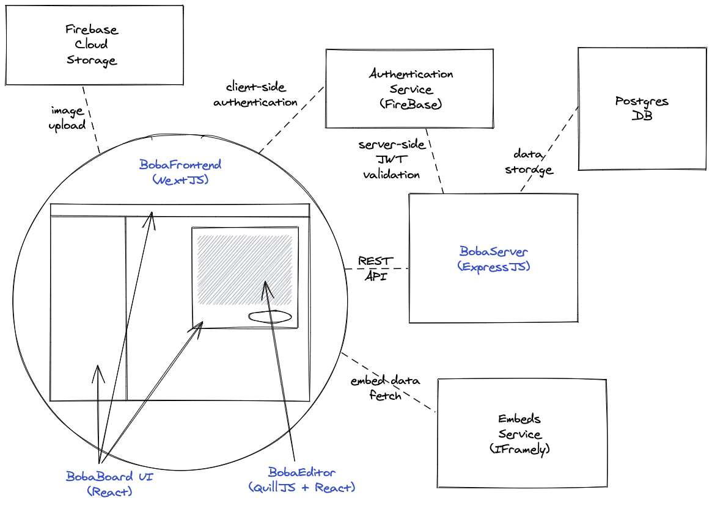

import { Aside } from '@astrojs/starlight/components';

BobaBoard's codebase is split within 4 separate repositories, each with its own
purpose and set of technologies:

- [**boba-editor**](#bobaeditor): our text editor.
- [**boba-components**](#boba-components): our "design system".
- [**boba-backend**](#boba-backend): "makes the magic happen" (i.e. saves and
  processes data).
- [**boba-frontend**](#boba-frontend): ties verything together into something
  _aspirationally_ usable and useful.

:::note Why this split?

- **Building a functional, multimedial text editor is a lot of work.** By
  splitting it in its own codebase, we want to facilitate its reuse across
  different projects. This also applies to our design system, albeit at a
  different level.
- **Logic encapsulation.** We want to avoid
  [coupling](<https://en.wikipedia.org/wiki/Coupling_(computer_programming)>)
  different part of the system. Especially in an environment where volunteers
  can come and go, maintainability is a huge concern. This split forces
  [separation of concerns](https://en.wikipedia.org/wiki/Separation_of_concerns).
- **Bring Your Own Frontend:** While this is very aspirational, we want to
  eventually enable people to create separate clients for BobaBoard. Note that
  this won't be possible until the project is stable enough to create a solid
  contract between different parts of the system.
- **Licensing:** By splitting the codebase, we can apply different licenses to
  different parts of the project.

:::

## boba-editor

\[[code](https://github.com/BobaBoard/boba-editor),
[demo](https://bobaeditor.netlify.app/?path=/story/editor-preview--simple-editor)]

boba-editor is BobaBoard's own extension of the
[QuillJS text editor](https://quilljs.com/), and is responsible for anything
related to **text formatting** and **embeds** (both in "edit" and "display"
mode).

Content created through boba-editor is stored in the **"Quill Delta" format**,
an abstract representation that can be translated into other formats, including
HTML, through various parsers.

Since other BobaBoard codebases should not interact with this format directly,
**boba-editor also exports utilities to manipulate the Delta format itself**
(e.g. extracting images for upload, removing trailing spaces, etc).

<Aside type="tip">

**Edit this codebase if:** you want to give users more input options, including
embeds, images and gifs.

</Aside>

## boba-components

\[[code](https://github.com/BobaBoard/boba-components),
[demo](https://bobaboard-ui.netlify.app/)]

boba-components is where BobaBoard's UI pieces (components) are developed, as
separate from the "frontend/server logic" as possible to facilitate reuse and
(one day) ease of testing. This is made possible by using
[StoryBook](https://storybook.js.org/), which you can see in action at this
[demo link](https://bobaboard-ui.netlify.app/).

<Aside type="tip">

**Edit this codebase if:** you want to improve the functionality/look of
specific boba-components elements, like buttons, contributions, sidebar
elements, thread stems, etc.

</Aside>

## boba-frontend

[code](https://github.com/essential-randomness/boba-frontend)

The BobaBoard frontend repository is in charge of managing the full BobaBoard
user experience, putting together the components defined in boba-components (see
above) into logical pages, and handling the communication between the user and
the server. Based on [NextJS](https://nextjs.org/).

<Aside type="tip">

**Edit this codebase if:** you want to change how UI elements come together to
create pages like boards, threads, settings and the related user flows.

</Aside>

## boba-backend

[code](https://github.com/BobaBoard/boba-backend)

The BobaBoard backend repository is an [ExpressJS](https://expressjs.com/)
server, communicating with the boba-frontend through a REST API.

Other than the server itself, this repository contains table definitions for
BobaBoard's PostgreSQL DB.

Other technologies used include a [Redis Cache](https://redis.io/) and
[Jest](https://jestjs.io/) for testing.

<Aside type="tip">

**Edit this codebase if:** you want to add new functionality to BobaBoard that
goes beyond the interaction with the user (or fix existing bugs).

</Aside>
