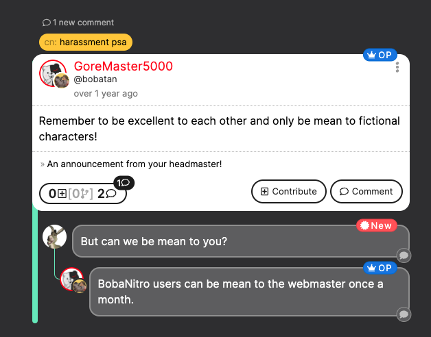
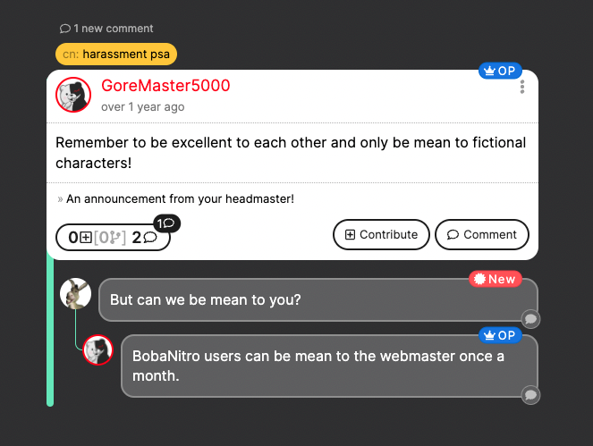

import { Aside } from "@astrojs/starlight/components";

BobaBoard assigns random identities from a shared pool of identities known as
the [**Bobadex**](#the-bobadex) to its users. The identities are assigned when
you create a thread or when you make your first contribution or comment to a
thread. Each identity consists of an avatar and a pseudonym.

For example, when you post to a board, you could be assigned the identity
"Outdated Meme". Every time you reply to a comment or contribution to your post,
you will remain as "Outdated Meme".

If you comment on someone else's post, you may see that "Outdated Meme" was
assigned to another commenter and now you have become "Bone Daddy".

<blockquote>
  You do a one pull gacha per thread from a specific pool of names.
  <cite>- Lavender Town Resident</cite>
</blockquote>

These identities remain anonymous publicly. No user can click through the
pseudonym or avatar to a profile, nor can they connect any specific posts,
comments, or contributions to your account. However, you remain identifiable
within the thread; there's no need for awkward "same anon" identifiers or "OP
here" workarounds. Not only does having anonymity in a fandom space allow you to
be as weird as you want, but it also allows you to post without anxiety about
being _too active_ or _not active enough_. If you post hundreds of times in a
day or disappear for three months, people won't necessarily know.

<Aside type="caution">

While your real identity is not publicly visible, your posts and comments are
still associated with your account and can be de-anonymized and subjected to
moderation.

For more info, please see [When and How We Deanon](#when-and-how-we-deanon).

</Aside>

You may be wondering "**How do I keep track of who I am if my identity changes
all the time?**" When you look at a post or comment you make, you will see both
the assigned anonymous identity and your actual account avatar; that way you can
keep track of who you are in the thread with a quick glance.

<figure>
  
  <figcaption>Your View</figcaption>
</figure>

<figure>
  
  <figcaption>Another User's View</figcaption>
</figure>

## Maintaining Your Anonymity

If you'd like to share a screenshot from BobaBoard with someone but don't want
them to be able to identify that you made the post or specific comments or
simply don't want them to see your account information, you can **Force hide
identity**. This will _remove_ the references to your actual account name and
the avatar you've uploaded.

To use this feature:

- **On Desktop:** click on your avatar in the top right of the screen to bring
  down the user menu, and select "Force hide identity".
- **On Mobile:** Open the BobaBoard by tapping the menu button on the top left,
  tap your avatar on the top right of the menu that slides out, and click "Force
  hide identity".

Please note that this option is a toggle. You can easily redisplay your account
information by following the process again to show "Display identity".

## Exceptions to Anonymity

In addition to the caution note above, there are a few exceptions to anonymous
identities:

- Static identities (roles)
  - For example, Ms. Boba has a Webmistress identity and volunteers may "wear" A
    Volunteer identity.
- Identity exchange
  - Users can choose to de-anonymize (with the aid of a moderator) if both users
    agree to it.

Users can also choose to post non-anonymous links (such as links to other social
media, personal websites, or other identifying content) if they choose to.
Anonymity is not an _enforced_ rule.

## The BobaDex

**The BobaDex** (or Dex, for short) is a collection (or multiple collections) of
identities that can be assigned at any given time on a Realm. It's designed to
encourage engagement by igniting the inner "Gotta Catch 'Em All" we all possess.

You can see the BobaDex for a Realm by clicking your user avatar (located on the
right of the top bar), and selecting "User Settings". Underneath your user info
is a list of BobaDex identities. Any identity you've received before will be
"unlocked" and will display the avatar and pseudonym. Identities you've never
received will simply be a number with no pseudonym listed.

The more you post, comment, or contribute, the more likely you are to complete
your BobaDex.

### Seasonal BobaDex

In addition to the "main" Realm BobaDex, Realms can have limited time or
seasonal BobaDexes whose identities are only used during certain time periods.
For example, the V0 realm has a _Spooky Scary Anons_ Dex which is only available
around Halloween.

## When and How We De-anon

In extreme cases, Ms. Boba (and in the future others with moderation abilities)
may force de-anon certain comments or exchanges as part of moderation. More
information concerning this process, when it is enacted, and how it is done will
be coming soon.

## Reporting Bad Behavior

If there is an interaction which is concerning or may need the attention of a
moderator, please complete the below Anonymous Feedback Form for the Realm where
the interaction took place. Be sure to select the "I'd like to report a
post/interaction" option.

- [v0 Realm](https://docs.google.com/forms/d/e/1FAIpQLSfyMENg9eDNmRj-jIvIG5_ElJFwpGZ_VPvzAskarqu5kf0MSA/viewform)
- Fandom Coders _coming soon!_ {/* TODO: ADD LINK */}
