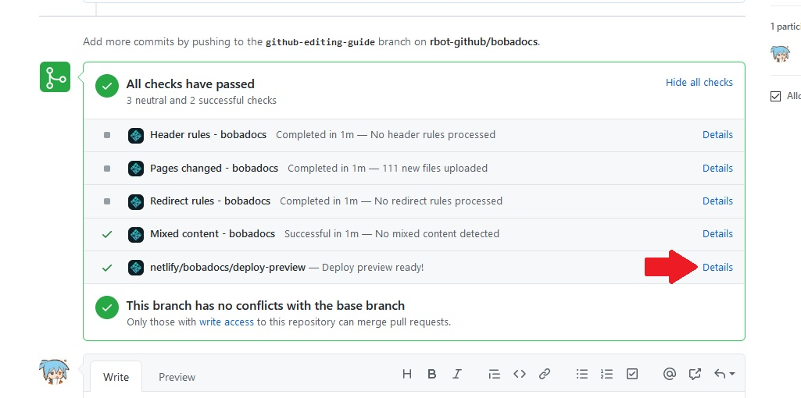
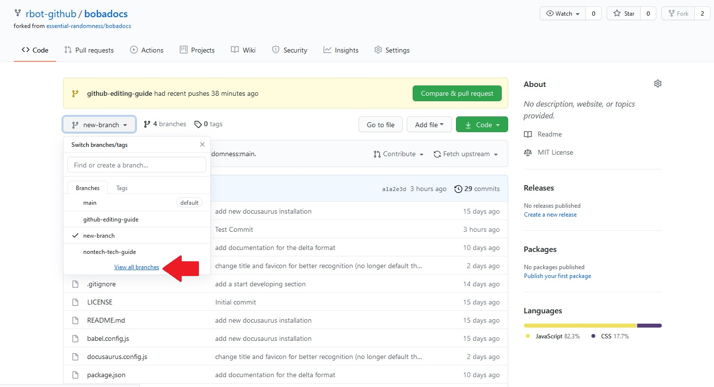
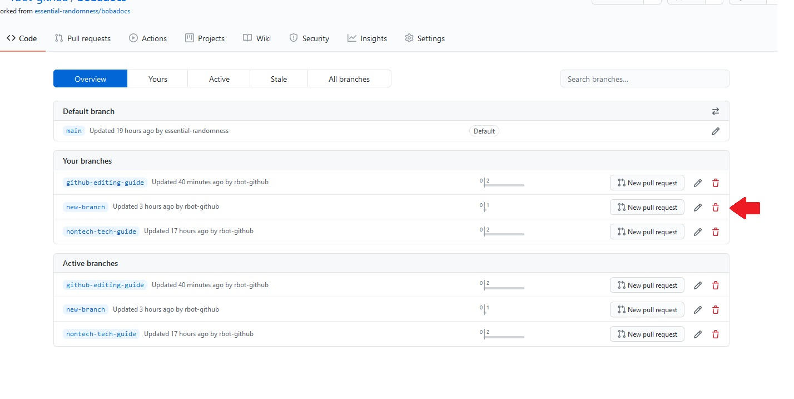

Additional how-tos that don't fit in the main guide.

## Adding new files

When navigating your repo, did you ever notice that there was an "Add file"
dropdown? Clicking it will let you add a new file **to the folder you're
currently in** with one of two ways: by creating one within the GitHub editor,
or by uploading one. Once you've selected an option, the process works the same
as making edits to and committing an already-existing file.

boba-docs generates sidebars automatically based on the filename of the pages in
it: **so make sure you title your filename with the title you want it to have on
the site**. Much like git branches, the format it uses is
`words-separated-by-dashes.md`. Using that as a filename would give you a page
listed as `Words Separated By Dashes` in the sidebar. Don't forget the `.md`, so
Docusaurus recognizes the filetype!

An aside: if any readers are interested in looking at Docusaurus and writing out
explanations, information on
[how to arrange the sidebar](https://docusaurus.io/docs/sidebar) and
[how to title pages](https://docusaurus.io/docs/docs-introduction/) would be
excellent additions to this guide.

## Adding images

Remember the `static` folder in the repo from earlier? You add images to your
page by uploading the images there (specifically within the `img` folder), then
linking to them within the page. Markdown's syntax for adding images is as
follows:

```

```

Docusaurus processes the filepath given in that syntax such that it's relative
to the `static` folder. Images go in the `img` folder within the `static`
folder, so many images on the site are linked to with:

```

```

If you have a folder within the `img` folder that your images are in, you'll
have to change the filepath accordingly. An example of this are the images on
this page: they're all in a folder named `volunteer` within the `img` folder.
Accordingly, the images on this page are linked to with:

```

```

## Looking at the things you made after submitting a pull request

Did you know that after submitting a pull request, you can check your changes in
a built version of the site? On the page of your pull request, scroll down until
you see the checks, and click the link shown below.



A version of boba-docs including the changes you made will open. You can poke
around, admire your work, and if you're quick, maybe catch a bug and fix it with
none the wiser.

## Deleting a branch

**If, for some reason, you have a branch that you don't need, here's how to get
rid of it.**

From the main page of your repo, click the branch dropdown, go all the way to
the bottom, and click "View all branches".



On the branches page, there's a list of your branches, along with buttons to
edit them. One of these is a delete button. Click it.



Just in case you've made a mistake, GitHub will give you a button to restore the
branch. This button disappears once you leave the page.