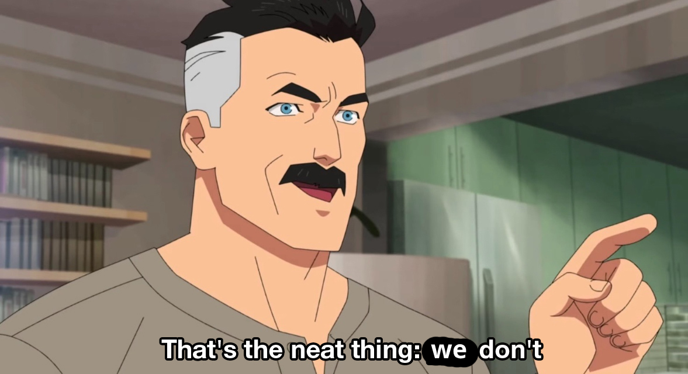

import { Aside } from '@astrojs/starlight/components';

<Aside type="caution">

We're currently in the early(ish) stages of figuring out how to organize
ourselves effectively. Expect things to be incomplete or change unexpectedly.

</Aside>

## How We Assign Roles

While we're still in the process of setting things up, we plan to use the Teal
Organization framework. In this framework, roles are not strictly assigned or
fixed. When you join you will have ample freedom to choose your first task, as
well as subsequent ones. If you want to try your hand at something managed by a
team you didn't start with, that's totally fine! All we ask is that you seek
advice on their processes, talk with involved people about what is needed, and
listen to their feedback.

Once you start volunteering, you'll always be welcome to come and go according
to your availability and interest. We give plenty of flexibility to carve your
own roles and tasks or offer to help people working on theirs.

You might be wondering: how do we even have teams if everything is flexible?
Over time people will naturally gravitate to their strengths and areas of
interest. Those people will eventually become "core members" of a team. While
they can also try something new or lend expertise to other efforts as
opportunities arise, they'll likely come back to their "home team" frequently.

## Coding Team

The coding team is our longest running team with the main goal of adding
features to and fixing bugs for BobaBoard software. We have been through a few
iterations of our processes and have learned a lot on the journey.

We periodically run sprints where we code together; we are trying to get better
at assigning tasks and delivering full-fledged features. Our current focuses are
adding the features to make Realms sustainable and making BobaBoard stable for
self-hosting.

## Communications Team

Our next team to form will be the communications team. The Communications Team
will be working to:

- solidify our internal and external documentation with the goals of helping us
  smooth out onboarding and make less work depend on ms. boba.
- build team processes and find ways to support collaborative writing efforts.
- support more open (and frequent!) external communication on social media.
- continue building our volunteer culture.

If any of this sounds like something you might like to work on, please
[Apply to Volunteer](../experience/volunteer-application)!

## Community Team

Coming soon, the Community Team will focus on sustaining and supporting
BobaBoard (and related) communities on all of our community channels. This team
will focus on things like:

- Day-to-day moderation of Discord, Github Discussions, and/or BobaBoard Realms.
- Working with the Communications Team to create Codes of Conduct and other
  related cultural documentation.
- Helping to create a fun and engaging volunteer experience.

<Aside type="caution">

The Community Team is the _least_ solidified of our team plans and all of the
above is subject to change!

</Aside>
